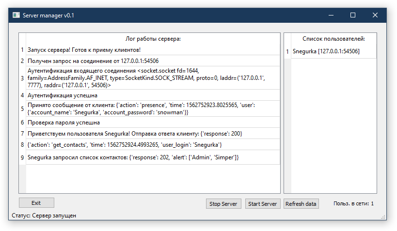

Server module
=================================================

Серверный модуль мессенджера. Обрабатывает словари - сообщения, хранит хешированные пароли клиентов и их список контактов.

*Использование*

Модуль подерживает аргементы командной стороки:

1. -p - Порт на котором принимаются соединения
2. -a - Адрес с которого принимаются соединения.

Примеры использования:

``python server.py -p 7777``

*Запуск сервера на порту 7777*

``python server.py -a localhost``

*Запуск сервера принимающего только соединения с localhost*

server.py
~~~~~~~~~

Запускаемый модуль,содержит парсер аргументов командной строки и функционал серверного приложения.

.. autoclass:: server.Server
	:members:
	
.. autoclass:: server.ServerManager
	:members:

.. autoclass:: server.ServerSocket
	:members:
	
server_database.py
~~~~~~~~~~~~~~~~~~

.. autoclass:: server_database.User
	:members:
	
.. autoclass:: server_database.User_sessions
	:members:

.. autoclass:: server_database.Users_online
	:members:
	
.. autoclass:: server_database.User_contact_list
	:members:
